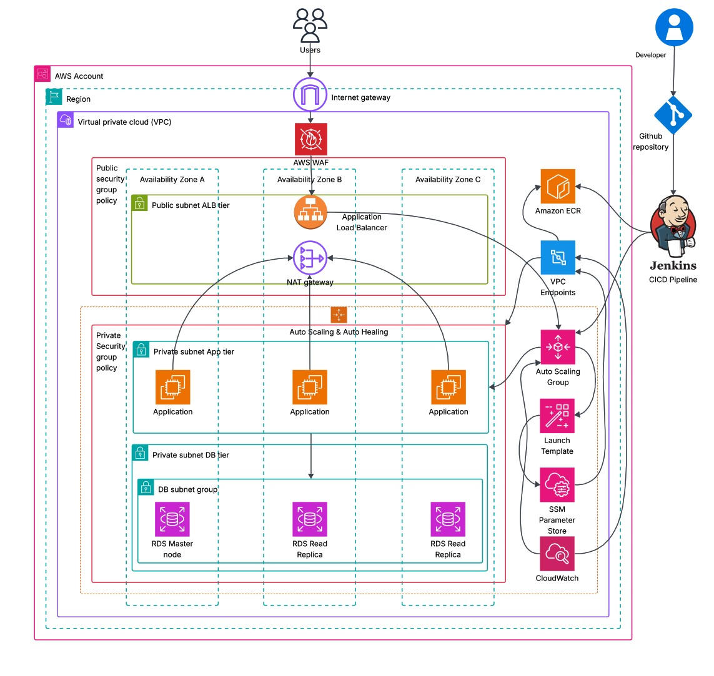

# 🌍 **Scalable Web Application with Auto-Healing on AWS**

**Author:** *Seyed Mojtaba Hosseini*

---

## 👋 **Introduction**

Hi — I’m **Seyed Mojtaba Hosseini**, a Computer Science Master's student, passionate about **cloud infrastructure, DevOps automation, and scalable systems**.
This project  **“Scalable Web Application with Auto-Healing on AWS”**  was built as my graduate-level DevOps portfolio project to demonstrate:

* Designing secure, fault-tolerant, production-grade infrastructure on **AWS**
* Automating provisioning using **Terraform (Infrastructure-as-Code)**
* Building and containerizing a **Java Web Application** with **Docker**
* Creating a complete **CI/CD pipeline** with **Jenkins + AWS ECR + GitHub**
* Achieving **auto-scaling** and **self-healing** behavior through **CloudWatch + ASG**

This application simulates a real-world production architecture that is:

* **Highly available** across multiple Availability Zones
* **Scalable** under varying workloads
* **Self-healing** when instances fail
* **Secure** using IAM roles and private subnets
* **Automated** from code commit → deployment

---

## 🧱 **Project Summary**

This system follows a **3-tier AWS architecture** with clearly separated layers:

| Tier                       | Components                                                                         | Purpose                                                                        |
| -------------------------- | ---------------------------------------------------------------------------------- | ------------------------------------------------------------------------------ |
| **Frontend (Public Tier)** | Internet Gateway, AWS WAF, Application Load Balancer (ALB)                         | Accepts external traffic and distributes requests securely                     |
| **Application Tier**       | Auto Scaling Group (EC2 instances via Launch Template) running Dockerized Java App | Scales up/down based on load; replaces failed instances (auto-healing)         |
| **Database Tier**          | Amazon RDS (MySQL) with read replicas in private subnets                           | Stores application data reliably and handles replication for high availability |

---

## 🏗️ **Architecture Overview**

<p align="center">
  
</p>

### 🔹 **Main AWS Components and Their Roles**

| Service                             | Role in Project                                                          |
| ----------------------------------- | ------------------------------------------------------------------------ |
| **VPC**                             | Provides an isolated virtual network for all resources                   |
| **Internet Gateway & NAT Gateway**  | Manage inbound/outbound traffic between public and private subnets       |
| **Route Tables & Security Groups**  | Define routing rules and firewall policies for each tier                 |
| **Application Load Balancer (ALB)** | Routes HTTP traffic across EC2 instances and performs health checks      |
| **Auto Scaling Group (ASG)**        | Dynamically adds/removes EC2 instances based on CPU metrics (CloudWatch) |
| **Launch Template**                 | Contains AMI details, user-data script, security groups, and IAM role    |
| **Amazon RDS (MySQL)**              | Provides a managed relational database service with read replicas        |
| **AWS SSM Parameter Store**         | Securely stores credentials (e.g., DB passwords)                         |
| **Amazon CloudWatch**               | Monitors metrics and triggers scaling or recovery events                 |
| **Amazon ECR Public**               | Hosts Docker images built by the pipeline                                |
| **IAM Roles & Policies**            | Apply least-privilege permissions to Terraform, EC2, and Jenkins         |
| **S3 + DynamoDB**                   | Backend for Terraform state storage and locking                          |
| **Jenkins + GitHub**                | CI/CD pipeline automating build, test, image push, and deployment        |

---

## ⚙️ **How the System Works**

1. **Developer** pushes new code to GitHub.
2. **Jenkins Pipeline** automatically builds the Java WAR (`mvn clean package`), creates a Docker image, and pushes it to **Amazon ECR Public**.
3. Jenkins then updates the AWS Auto Scaling Group (ASG) or triggers Terraform to refresh infrastructure.
4. **ALB** distributes user traffic across EC2 instances in multiple Availability Zones.
5. **ASG + CloudWatch** scale out when CPU usage rises and replace unhealthy instances automatically.
6. **RDS (MySQL)** stores persistent user data.
7. **SSM Parameter Store** provides database credentials securely to EC2 instances at runtime.

The entire workflow requires no manual intervention after initial setup — a fully automated, self-healing environment.

---

## 🧩 **Infrastructure Deployment with Terraform**

### 🪴 Commands

```bash
terraform init
terraform plan
terraform apply
```

After deployment:

```
alb_dns = "webapp-alb-xxxx.us-east-1.elb.amazonaws.com"
rds_endpoint = "webapp-db.xxxx.us-east-1.rds.amazonaws.com"
```

Visit `http://<alb_dns>` to see the running application.

To destroy:

```bash
terraform destroy
```

### 📦 Terraform Provisions

* VPC (public + private subnets across 3 AZs)
* Internet Gateway / NAT Gateway
* Route Tables + Security Groups
* ALB + Target Groups + Listeners
* ASG + Launch Template (User Data for Docker app)
* RDS MySQL Instance + Read Replicas
* CloudWatch Metrics & Alarms
* IAM Roles + SSM Parameters

---

## ☕ **Java Web Application**

This is a simple **Java Servlet + JSP** application that interacts with MySQL.
It uses **Maven** for builds and **Tomcat 9** inside a Docker container.

### 🐳 Run Locally with Docker Compose

```bash
mvn clean package
docker build -t webapp:1.0 .
docker-compose up -d
```

Visit `http://localhost:8080/webapp`

### ⚙️ Manual Setup

1. Install MySQL → import `db-schema.sql`
2. Install Tomcat 9 → copy `target/webapp.war` to `/opt/tomcat/webapps/`
3. Start Tomcat → open `http://<ip>:8080/webapp`

---

## 🤖 **CI/CD Pipeline (Jenkins + AWS ECR)**

### 🔄 Pipeline Flow

1. **Build** – `mvn clean package`
2. **Dockerize** – `docker build -t webapp:latest .`
3. **Push** – upload image to ECR repository
4. **Deploy** – refresh Auto Scaling Group to use new AMI or image

### 🧠 Automation Details

* Jenkins runs inside EC2 or Docker
* Has `docker`, `awscli`, and `git` installed
* Connected to GitHub via webhook (trigger on push to main)
* Push → Build → Deploy cycle takes ~5 minutes

---

## 🔒 **Security and Resilience**

* Private subnets for RDS and EC2
* Public access limited to ALB
* IAM roles with least-privilege policies
* SSM Parameter Store for secrets
* CloudWatch alarms for CPU and health
* ASG auto-healing replacement on failure

---

## 💰 **Cost Optimization**

| Resource                          | Notes                                |
| --------------------------------- | ------------------------------------ |
| EC2 t3.micro                      | Free-tier eligible                   |
| RDS db.t3.micro                   | Free-tier eligible                   |
| ALB + NAT Gateway                 | ~$0.06–0.08/hr (tear down when idle) |
| Terraform backend (S3 + DynamoDB) | negligible                           |

Always run `terraform destroy` after testing to avoid charges.

---

## 📊 **Monitoring and Logs**

* **CloudWatch Metrics**: CPU, network, status
* **CloudWatch Logs**: User-data + app logs
* **ALB Target Health**: auto-removes unhealthy instances

---

## 🧩 **Key Takeaways**

✅ End-to-end cloud-native web app with frontend, app, and DB tiers
✅ Auto-Scaling and Self-Healing via ASG + CloudWatch
✅ Zero-downtime deployments with Jenkins + ECR + Terraform
✅ Secure & modular architecture for real-world DevOps scenarios

---

## 🧾 **License**

MIT License — Free for educational and demonstration use.

---

## ❤️ **Acknowledgment**

Created by **Seyed Mojtaba Hosseini**
Built with ☕ Java  🐳 Docker  ☁️ AWS  🤖 Jenkins  💠 Terraform

---
